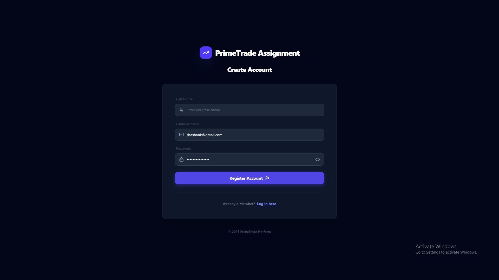
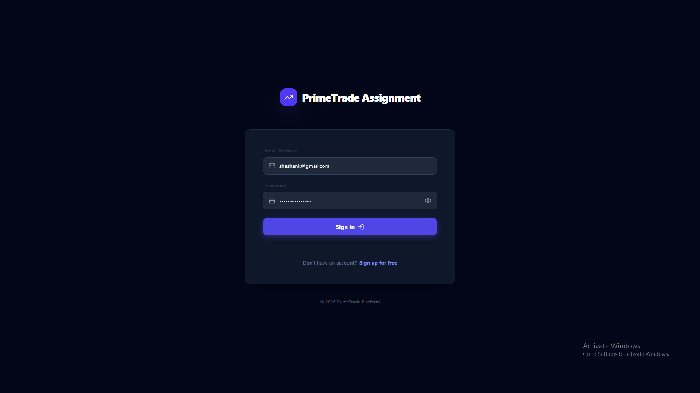
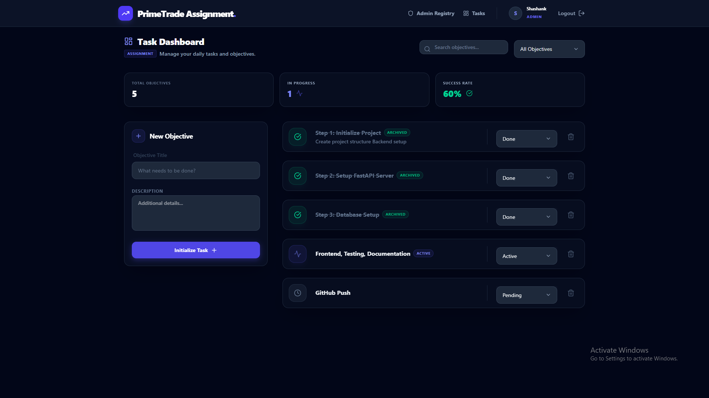
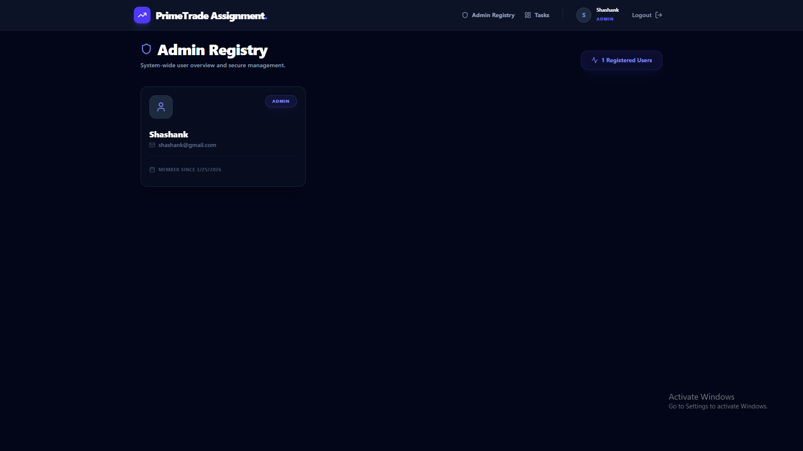
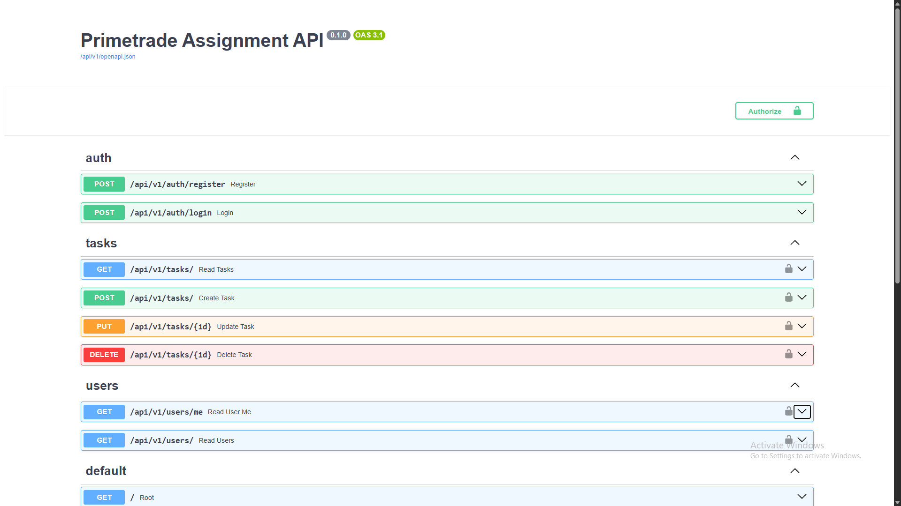
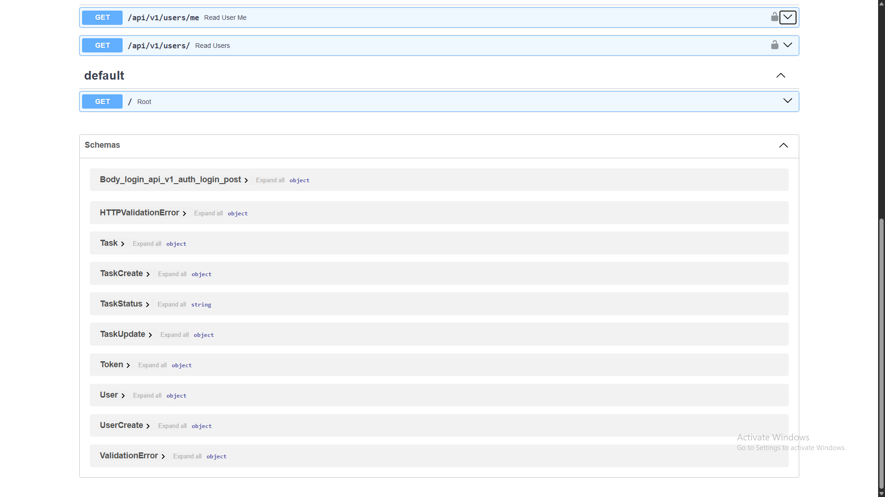

# 🚀 PrimeTrade Backend Assignment


## 📝 Overview
A scalable backend system built with FastAPI, featuring JWT authentication and Role-Based Access Control (RBAC), paired with a modern React frontend. Designed for high performance and maintainability.

## ✨ Features
- **JWT & RBAC**: Secure authentication with User/Admin roles and a dedicated **Admin Registry**.  
  *(Note: The first user to register on a fresh database is automatically assigned the Admin role.)*
- **Task CRUD**: Complete objective management with search, filtering, and strict ownership validation.
- **Premium UI**: Glassmorphism design with React + Tailwind, real-time **Toast notifications**, and smooth animations.
- **Testing**: Integrated Pytest suite for API validation.
- **API Docs**: Fully documented via Swagger UI.

## 🛠 Tech Stack
- **Backend**: FastAPI, SQLAlchemy, Pydantic, Jose (JWT), Passlib (bcrypt).
- **Frontend**: React (Vite), Axios, Tailwind CSS, Lucide Icons.
- **Database**: SQLite (PostgreSQL compatible).

## 📁 Project Structure
```text
backend/     -> FastAPI Application (Core Logic, Models, Routes)
frontend/    -> React Application (UI, Components, API Client)
docs/        -> Detailed Documentation & Walkthrough
screenshots/ -> Visual Demonstration of the Project
```

## ⚡ Quick Start

### 1️⃣ Clone & Setup
```bash
git clone https://github.com/shashanknamdeo/primetrade-assignment.git
```

### 2️⃣ Backend Run
```bash
cd backend
python -m venv venv
.\venv\Scripts\activate
pip install -r requirements.txt
uvicorn app.main:app --reload
```
Server: `http://localhost:8000` | Docs: `http://localhost:8000/docs`

### 3️⃣ Frontend Run
```bash
cd frontend
npm install
npm run dev
```
Local: `http://localhost:5173`

## 🔗 API Endpoints
### Auth
- `POST /api/v1/auth/register` - Create new account
- `POST /api/v1/auth/login` - Authenticate and get token

### Tasks
- `GET /api/v1/tasks` - List user's tasks
- `POST /api/v1/tasks` - Create new task
- `PUT /api/v1/tasks/{id}` - Update task
- `DELETE /api/v1/tasks/{id}` - Remove task

### Admin
- `GET /api/v1/users` - List all users (Admin only)

## 🔑 Environment Variables
Defined in `backend/.env.example`:
```env
DATABASE_URL=sqlite:///./sql_app.db
SECRET_KEY=your_secret_key
ALGORITHM=HS256
ACCESS_TOKEN_EXPIRE_MINUTES=10080
```

## 🧪 Testing
```bash
cd backend
.\venv\Scripts\pytest.exe
```

## 📸 Screenshots


### Login and Signup page

<p align="center">
  <a href="./screenshots/signup.png">
    
  </a>
  <a href="./screenshots/login.png">
    
  </a>
</p>


### Deshboard and Admin page

<p align="center">
  <a href="./screenshots/dashboard.png">
    
  </a>
  <a href="./screenshots/admin.png">
    
  </a>
</p>


### API Documentation (Swagger)

<p align="center">
  <a href="./screenshots/swagger-1.png">
    
  </a>
  <a href="./screenshots/swagger-2.png">
    
  </a>
</p>

## 🚀 Scalability
Detailed in [PROJECT_WALKTHROUGH.md](docs/PROJECT_WALKTHROUGH.md). Supports Redis, Docker, and Microservices migration.

## 📦 Deliverables
✔ Backend API with JWT & RBAC  
✔ React Frontend with Admin Dashboard  
✔ Real-time Toast Notification System  
✔ Task CRUD with Search & Filters  
✔ Swagger & Pytest Suite  
✔ Professional Documentation  

## 👨‍💻 Author
**Shashank Namdeo**  
Backend Developer Candidate  
[GitHub](https://github.com/shashanknamdeo) | [Email](mailto:shashanknamdeo28@gmail.com)  
Mobile: +91 9981325976
